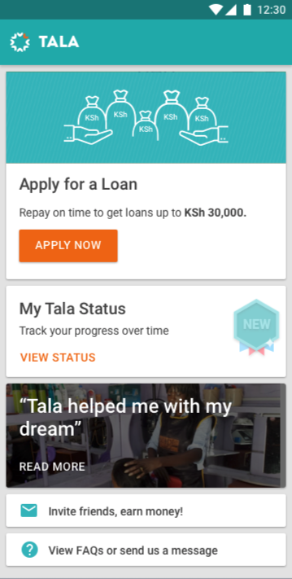
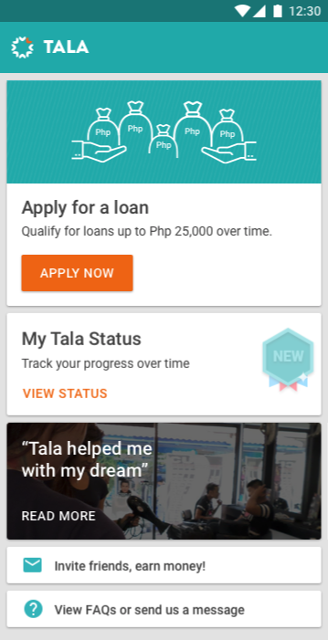
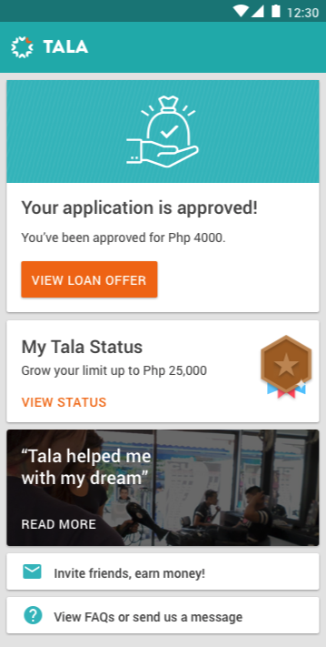
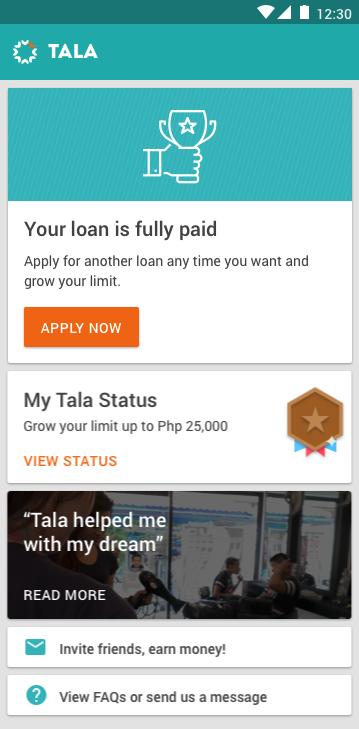
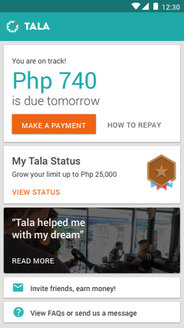
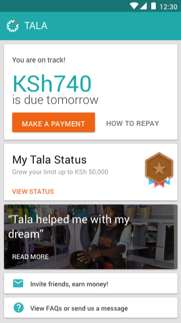

# CASE STUDY FOR Senior Android Engineer (Kotlin) - [Tala](https://tala.co/)

---
### Description
Given the array of data in testData.json, show a vertical scrolling list of cards for each item,
matching the provided comps (screen#.png) based on the data. Users should be able to logically
interact with each card, though what the app does when the user interacts with them is up to
you.
It’s also up to you on how to allow switching between the different provided test data, but each
data item should be a separate experience (don’t show all cards for all data at the same time).
Due to the time limitations for this project, we can't answer questions related to the instructions
or implementation. If you have any questions, please use your best judgment and make a note
of any assumptions you made which you would have otherwise asked about under normal
circumstances. You won't be penalized or asked to redo the test based on any noted incorrect
assumptions.

#### Deliverable
Host the project on github or bitbucket and send us a link. This project should be set up to run
on any machine, so it should not have any unresolved or local references.
Make sure that the project compiles with Java 8 and runs on a Pixel 5 emulator.

#### Screens as Provided
Screen 1A           |  Screen 1B            |  Screen 2
:-------------------------:|:-------------------------:|:-------------------------:
  |    |  

Screen 3           |  Screen 4A            |  Screen 4B
:-------------------------:|:-------------------------:|:-------------------------:
  |    |  

## Architecture
* Built with Modern Android Development practices
* Utilized Usecase, Repository pattern for data
* The case study expected data to be downloaded from the assets folder, but have taken the liberty of demonstrating both use-cases where
  we get the data from [json file from here](https://github.com/jeremy02/Tala-Challenge/blob/main/app/src/main/assets/testData.json?raw=true) here using retrofit and also the locales data from the assets/locales.json file

## 📱 Download Demo on Android
Download the [APK file from here]() on your Android phone and enjoy the Demo App :)

## Built With 🛠
- [Kotlin](https://kotlinlang.org/) - Currently official programming language for Android development.
- [Coroutines](https://kotlinlang.org/docs/reference/coroutines-overview.html) - For Asynchronous or non-blocking programming and more..
- [Flow](https://kotlin.github.io/kotlinx.coroutines/kotlinx-coroutines-core/kotlinx.coroutines.flow/-flow/) - A cold asynchronous data stream that sequentially emits values and completes normally or with an exception.
- [Android Architecture Components](https://developer.android.com/topic/libraries/architecture) - Collection of libraries that help you design robust, testable, and maintainable apps.
  - [LiveData](https://developer.android.com/topic/libraries/architecture/livedata) - Data objects that notify views when the underlying database changes.
  - [ViewModel](https://developer.android.com/topic/libraries/architecture/viewmodel) - Stores UI-related data that isn't destroyed on UI changes.
  - [ViewBinding](https://developer.android.com/topic/libraries/view-binding) - Generates a binding class for each XML layout file present in that module and allows you to more easily write code that interacts with views.
- [Dependency Injection](https://developer.android.com/training/dependency-injection)
  - [Hilt](https://dagger.dev/hilt) - Easier way to incorporate Dagger DI into Android apps. **This is in the [main branch](https://github.com/wajahatkarim3/Imagine)**.
  - [Dagger2](https://dagger.dev/) - Standard library to incorporate Dagger dependency injection into an Android application. **This is in a separate [dagger branch](https://github.com/wajahatkarim3/Imagine/tree/dagger-branch).**
- [Retrofit](https://square.github.io/retrofit/) - A type-safe HTTP client for Android and Java.
- [Material Components for Android](https://github.com/material-components/material-components-android) - Modular and customizable Material Design UI components for Android.
- [Gradle Kotlin DSL](https://docs.gradle.org/current/userguide/kotlin_dsl.html) - For writing Gradle build scripts using Kotlin.
- [MockK](https://mockk.io) - For Mocking and Unit Testing

## TODO
* Includes unit tests for Use cases, Repository, ViewModels, API Service response.
* Complete the various screens so as to create interactive elements which behave as expected for users
* Online/offline experience where if offline the data is downloaded from the API endpoints using Retrofit and Offline fallback to data in assets folder
* Include Search and filter

## Developed By

**Jeremiah Thuku**

